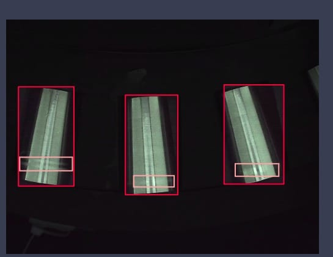

# Defective Tapper Roller Detection

## Overview
The **Defective Tapper Roller Detection** system is an advanced solution to identify defects in industrial rollers. Using state-of-the-art machine learning and computer vision techniques, this system is designed to detect various defects such as rust, dent, damage, scratches, and more across different parts of the roller. By integrating with a Siemens S7 PLC, the system analyzes roller images from an industrial camera and determines whether each roller should be accepted or rejected based on defect detection.Graphical User Interface (GUI) built with Tkinter is provided for easy interaction with the system, allowing users to configure settings, visualize results, and control the roller inspection process.

## Key Features
- **Defect Detection**: Detects various defects such as:
  - Rust
  - Dent
  - Damage on the outer diameter
  - Damage on the large end
  - Damage on the small end
  - Damage on the dimple
  - Damage on the bigface
  - Flat lines
  - Chatter on outer diameter
- **Threshold Adjustment**: Allows customization of defect detection thresholds for individual defect classes.
- **High-Speed Imaging**: Utilizes an industrial camera with 90 FPS to capture high-quality images.
- **Real-time Analysis**: Conveyor system operates at 120 RPM, enabling real-time roller inspection.
- **PLC Integration**: Seamlessly integrates with the Siemens S7 PLC for control and automation.
- **Model Optimization**: Employs YOLOv8 and YOLOv10 for object detection, leveraging Python multiprocessing for efficient processing.
- **CUDA Support**: Utilizes GPU acceleration with CUDA for high-speed model inference.
- **Auto Labeling and Data Augmentation**: Grounding DINO for auto-labeling and Roboflow for data annotation and augmentation.
- **Performance Optimization**: Experimented with Sahi inference, object detection models, and quantization techniques to improve the system's performance and speed.
- **User Interface**: A Tkinter-based GUI for monitoring and controlling the system in real-time.

## Technologies Used
- **YOLOv8 and YOLOv10**: State-of-the-art object detection models used for defect identification.
- **Python Multiprocessing**: To parallelize tasks and improve inference speed.
- **Python Snap7 Package**: For communication with Siemens S7 PLC.
- **CUDA**: GPU acceleration for faster model inference and processing.
- **Grounding DINO**: Used for auto-labeling roller defects.
- **Roboflow**: Used for defect annotation, data augmentation, and model training.
- **Ultralytics**: Framework used for training the YOLO models.
- **SAHI Inference**: For optimizing object detection and inference on large images.
- **Tkinter**: Python library used for building the user interface for real-time monitoring and control.

## System Architecture
The system is designed to inspect rollers as they move on a conveyor belt. The industrial camera captures images at 90 FPS. These images are then processed using YOLOv8/YOLOv10 models, which are optimized using CUDA for real-time defect detection. Once defects are identified, the results are sent to the Siemens S7 PLC for decision-making (accept or reject). The entire process is monitored and controlled via the Tkinter GUI.

### Key Components:
1. **Industrial Camera (90 FPS)**: Captures high-resolution images of the rollers.
2. **Conveyor System (120 RPM)**: Moves rollers past the camera for inspection.
3. **Object Detection Models**: YOLOv8 and YOLOv10 detect defects in roller images.
4. **Python Multiprocessing**: Parallelizes tasks to speed up the processing time.
5. **Siemens S7 PLC**: Controls the acceptance/rejection of rollers based on defect analysis.
6. **Grounding DINO**: For auto-labeling roller defect data.
7. **CUDA-Enabled GPU**: Accelerates the model inference process.
8. **Tkinter GUI**: Interface for users to interact with the system, monitor status, and control the roller inspection process.

## Installation

### Prerequisites:
- Python 3.10+
- CUDA 12.4+ (for GPU acceleration)
- Siemens S7 PLC (for integration)
- Industrial Camera with 90 FPS capability
- Roboflow account for data annotation
- Tkinter library (usually comes with Python, but can be installed if missing)

### Threshold Adjustment:
You can fine-tune the threshold for individual defect classes by adjusting the parameters in the configuration file (`config.yaml`).

## Dataset Information
| Property      | Value              |
| ------------- | ------------------ |
| Dataset Size  | 14,000 images      |
| Classes       | 9 defect types     |
| Format        | YOLO format        |
| Split         | 80/10/10           |

## Tkinter User Interface
A simple **Tkinter GUI** is included to allow users to interact with the roller detection system.

### Features of the GUI:
- **Start/Stop System**: Control the start and stop of the roller inspection system.
- **Real-time Display**: View the real-time images of the rollers being processed.
- **Defect Analysis**: Display the results of defect detection, including type and location of defects.
- **Threshold Adjustment**: Modify defect detection thresholds for each class via sliders.
- **PLC Status**: Monitor the communication status with the Siemens S7 PLC.

## Usage
Once the system is set up and trained, you can control and monitor it through the Tkinter GUI:

1. **Start the Conveyor**: The conveyor system will rotate at 120 RPM.
2. **Capture Roller Images**: The industrial camera captures images of each roller.
3. **Defect Detection**: The images are processed using the trained YOLO model to detect defects.
4. **Accept/Reject Decision**: Based on the defect analysis, the PLC will make a decision to accept or reject the roller.
5. **Control via GUI**: Use the Tkinter GUI to start/stop the inspection, adjust thresholds, and monitor system status.

## Performance Optimization
The system has undergone several optimizations to improve performance:
- **Sahi Inference**: Optimized inference for large images.
- **Quantization**: Reduced model size and improved inference speed by quantizing the trained models.
- **Data Augmentation**: Enhanced model accuracy by performing extensive data augmentation and preprocessing.

## Performance Metrics

### Training Losses
| Loss Metric | Value |
| ----------- | ----- |
| Box Loss    | 0.34  |
| Cls Loss    | 0.18  |
| DFL Loss    | 0.28  |

### Evaluation Metrics
| Metric     | Value    |
| ---------- | -------- |
| Precision  | 0.95     |
| Recall     | 0.92     |
| mAP50      | 0.98     |
| mAP50-95   | 0.77     |

### Training Parameters
| Parameter        | Value                          |
| ---------------- | ------------------------------ |
| Batch Size       | 32                             |
| Epochs           | 200                            |
| Patience         | 20                             |

### Model Conversion and Inference Latency
The PyTorch model has been converted to TensorRT for optimized inference on NVIDIA GPUs.

| Model Format       | Latency  |
| ------------------ | -------- |
| PyTorch (.pt)      | 8-10 ms  |
| TensorRT (.engine) | 5-6 ms   |

**Performance Improvement**: TensorRT model achieves ~40-50% faster inference latency compared to the PyTorch model.

## Contributing
Contributions are welcome! Please feel free to fork this repository, submit issues, and create pull requests.

## License
This project is licensed under the MIT License.